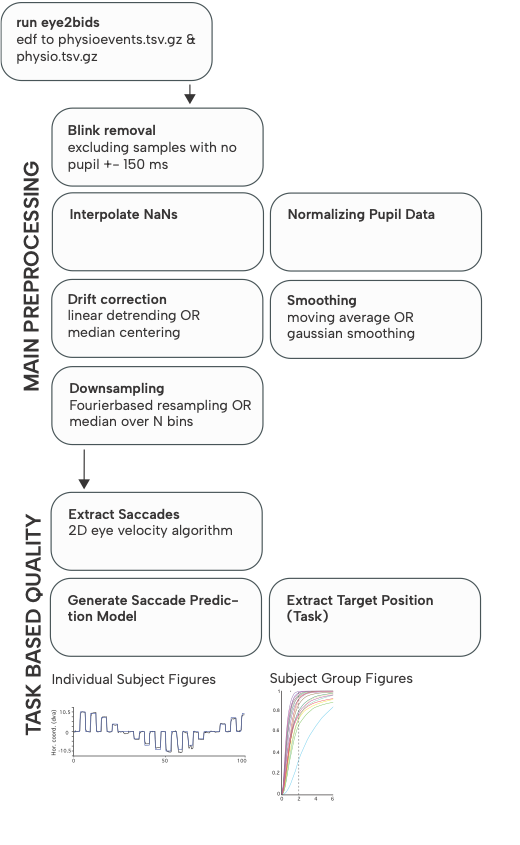

# eyeprep

[](https://opensource.org/licenses/MIT)
[](https://www.python.org/downloads/)

Standardized preprocessing pipeline for BIDS-formatted eye-tracking data.

-------
Version 0.01


## Installation steps

Install SR reseach developers kit: https://www.sr-research.com/support/docs.php?topic=linuxsoftware

### Option A — Mamba/Conda

Set up a local development environment to run and modify eyeprep with its dependencies. The main external dependency is eye2bids.

```
mamba env create -f environment.yml
mamba activate eyeprep
```
- This installs eyeprep (editable) and eye2bids as declared. To update the environment after changes:
```
mamba env update -f environment.yml --prune
```
- Run tasks:
```
pytest
ruff check .
mypy .
```

### Option B — Hatch
```
hatch env create
hatch shell
pip install -e .
```

Notes: 
- pip install -e . installs dependencies declared in pyproject.toml, including eye2bids.
- hatch env create provisions the virtual environment from pyproject.toml; hatch shell activates it.
 
- Common tasks:
```
# Run test suite
hatch run test

# Lint and format
hatch run lint
hatch run format

# Type-check
hatch run type-check

# Build a wheel and sdist
hatch build
```

## Build and Publish

1. Build distributions:
```hatch build
# created under dist/
```

2. Publish to PyPI (requires credentials):
```
# using hatch’s built-in publisher
hatch publish
```

## Why This Exists

Eye-tracking is increasingly used in fMRI and cognitive neuroscience, but preprocessing is inconsistent. We've created a [BIDS Extension Proposal (BEP20)](https://bids.neuroimaging.io/extensions/beps/bep_020.html) to standardize eye-tracking data format, and this tool makes that standard immediately useful.
Eyetracking BIDS specification documentation: https://bids-specification.readthedocs.io/en/latest/modality-specific-files/physiological-recordings.html

**Format your data once with BIDS → Get preprocessing forever**

## How It Works (for now)

<p align="center">
  
</p>

eyeprep takes BIDS-formatted eye-tracking data through a series of validated preprocessing steps, followed by quality assessment to ensure your data is analysis-ready.

### Preprocessing Steps
- **Blink Removal** → **Interpolation** → **Normalization** → **Drift Correction** → **Smoothing** → **Downsampling**

### Quality Assessment
- Extracts saccades using 2D velocity algorithm
- Generates prediction models for task performance
- Produces individual and group-level quality metrics

[Learn more about each step →](docs/preprocessing.md)


## Documentation (TODO)

- [Getting Started Guide](docs/getting_started.md)
- [Preprocessing Options](docs/preprocessing.md)
- [Configuration Files](docs/configuration.md)
- [Tutorial Notebooks](examples/)

## 🤝 Contributing

We welcome contributions! This project is part of [Brainhack 2026](https://brainhack-marseille.github.io/).

- See our [Contributing Guide](CONTRIBUTING.md)
- Join the discussion on [GitHub Discussions](https://github.com/sinaklg/eyeprep/discussions)


## 🏆 Brainhack Project

This tool is being developed as part of Brainhack 2026. Check out the [project page](https://brainhack-marseille.github.io/) to get involved!

**Skills we need:**
- Python development
- Documentation writing
- Data visualization
- DevOps (Docker, CI/CD)

## Citation

If you use this tool, please cite:
- Our BEP20 paper: [github_discussion] (https://github.com/bids-standard/bids-specification/discussions/2218#discussioncomment-15164225)


## 📧 Contact

- Project Lead: [Sina Kling] - [@github](https://github.com/sinaklg) - email sina.kling@univ-amu.fr
- Issues: [GitHub Issues](https://github.com/sinaklg/eyeprep/issues)
- Chat: [Mattermost](link)
