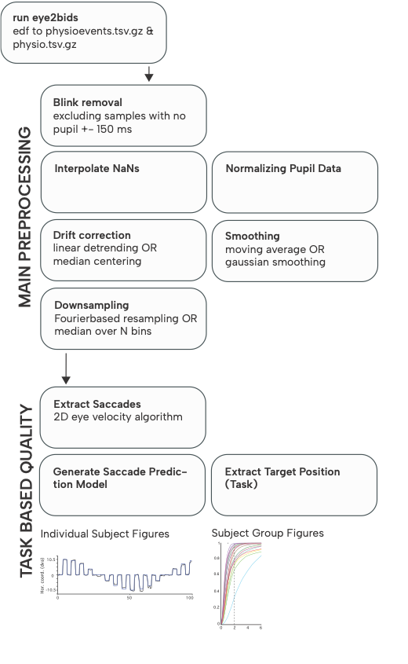

# eyeprep

[](https://opensource.org/licenses/MIT)
[](https://www.python.org/downloads/)

Standardized preprocessing pipeline for BIDS-formatted eye-tracking data.

Authors: Sina KLING, Marianne DUYCK, Giorgio MARINATO, Martin SZINTE
-------
Version 0.02


## Installation steps (dependencies)

Install SR reseach developers kit: https://www.sr-research.com/support/docs.php?topic=linuxsoftware

## Developer setup with uv

### One-time setup

- Ensure uv is installed (see https://github.com/astral-sh/uv)

- Clone the repository

- Create a virtual environment:
```
uv venv .venv
```

- Activate the created virtual environment
```
source .venv/bin/activate
```

- Sync dependencies:
```
uv sync --all-extras
```
This ensures everyone has matching versions as declared in `pyproject.toml`.

#### Adding dependencies
Use `uv add` to manage dependencies in `pyproject.toml`:
- Runtime dependency:
```
uv add <package-name>
```
- Dev-only dependency:
```
uv add --dev <package-name>
```
This keeps `dependencies` and `optional-dependencies.dev` up to date automatically.

#### Current declared dependencies
- Runtime: `eye2bids` (installed from GitHub via VCS URL)
- Dev: `pytest`, `ruff`, `mypy`

#### Typical developer workflow
1) Activate venv:
```
source .venv/bin/activate
```
2) Sync environment:
```
uv sync --all-extras
```
3) Run tests and linters:
```
pytest
ruff check .
mypy .
```
4) Make changes to `eyeprep` code and re-run tests; editable installs are handled automatically by `uv sync`.


## Why This Exists

Eye-tracking is increasingly used in fMRI and cognitive neuroscience, but preprocessing is inconsistent. We've created a [BIDS Extension Proposal (BEP20)](https://bids.neuroimaging.io/extensions/beps/bep_020.html) to standardize eye-tracking data format, and this tool makes that standard immediately useful.
Eyetracking BIDS specification documentation: https://bids-specification.readthedocs.io/en/latest/modality-specific-files/physiological-recordings.html

**Format your data once with BIDS → Get preprocessing forever**

## How It Works (for now)

<p align="center">
  
</p>

eyeprep takes BIDS-formatted eye-tracking data through a series of validated preprocessing steps, followed by quality assessment to ensure your data is analysis-ready.

### Preprocessing Steps
- **Blink Removal** → **Interpolation** → **Normalization** → **Drift Correction** → **Smoothing** → **Downsampling**

[Learn more about each step →](docs/preprocessing.md)

### Quality Assessment
- produces individual quality metrics : Proportion of missing data, gaze overview relative to screen, proportion of valid data after blink removal (inkl. blink distribution plot), noise quantification 
- Saccade detection 

## 🤝 Contributing

We welcome contributions! This project is part of [Brainhack 2026](https://brainhack-marseille.github.io/).

- See our [Contributing Guide](CONTRIBUTING.md)
- Join the discussion on [GitHub Discussions](https://github.com/sinaklg/eyeprep/discussions)

## Citation

If you use this tool, please cite:
- Our BEP20 paper: [BIORXIV] (https://www.biorxiv.org/content/10.64898/2026.02.03.703514v1)


## 📧 Contact

- Project Lead: [Sina Kling] - [@github](https://github.com/sinaklg) - email sina.kling@univ-amu.fr
- Issues: [GitHub Issues](https://github.com/sinaklg/eyeprep/issues)
- Chat: [Brainhack Mattermost](https://mattermost.brainhack.org/brainhack/channels/bhg26-marseille-eyeprep)
